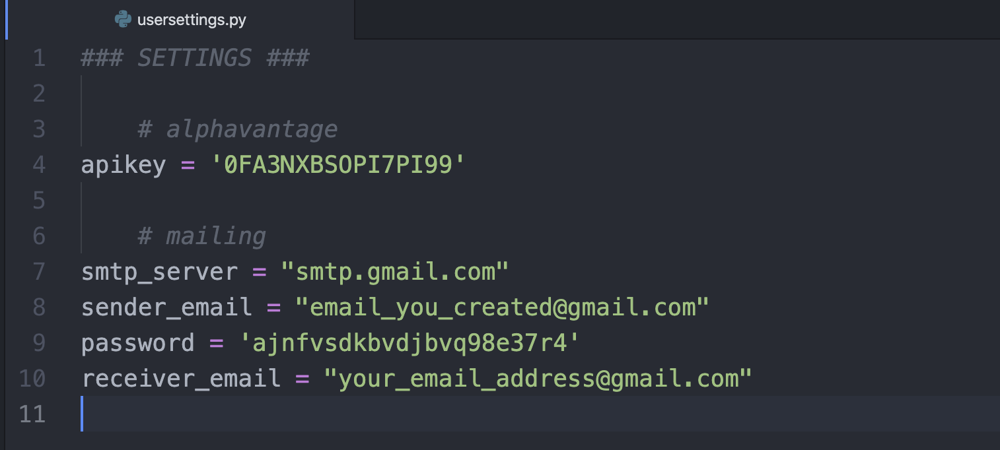

# Trading Bot

This is the repository for all of the bot code.

**Author:** Guillem Fortó<br>
**Date:** April 2020

## Description
Creating a trading bot is a project I'd had in mind for quite a while, but in which I could never really find time to invest. I took advantage of the lockdown during Covid-19 pandemic to gain some knowledge about finance in general, and to do some research about the different big trading methods that exist. During this period, I also found some useful tools to retrieve real-time financial data such as Alphavantage free service. Hence, I decided it was worth trying to design a trading strategy on paper, and that it could be fun to implement it in an algorithmic way later on. Together with some stop-loss orders, and the subsequent trading triggers and portfolio management that go along with it, it looked like a nice challenge to me!

The result is this bot, which is basically a simulation of a trading session during a given period of time. The number of days is defined by the user at the beginning of the session.<br>
Once launched, it will also ask for how much are you willing to virtually invest, and then wait till NYSE opens (assuming you launched it outside trading hours).

The pre-trading preparation starts by selecting the equities on which it will trade for the whole period (see *get_candidate_equities()* in `data_retrieval.py`). There is a list of tickers it will go through, checking one-by-one if it is 'suitable' or not to keep it, meaning if it detects trading opportunities or not.<br>
To do so, I decided to use [yfinance](https://pypi.org/project/yfinance/) package in order to retrieve the last 250 data points for the ticker, which translates into collecting last year's closing prices. The goal is to find suitable supports and resistances, in which case it will consider there is a trading opportunity.<br>
Of course, you can add or delete tickers yourself in the `real_time_tickers` dictionary in `globalenv.py`. If you do so, make sure the company is currently listed on NYSE. Also, for a stock to be selected, the bot will check if Alphavantage can retrieve real-time data for it. Therefore, you might want to previously check it yourself by replacing the ticker and the API key in the following link: https://www.alphavantage.co/query?function=TIME_SERIES_INTRADAY&symbol=IBM&interval=1min&outputsize=full&apikey=demo. Note that the frequency interval of retrieval is always 1 min.<br>
In case both conditions are satisfied (support and resistance found + real-time data available), it will show the corresponding chart and you will have the final word to decide if you should keep it for the rest of the session or not (here, 'keeping it' means that we will be constantly retrieving closing prices).<br>

Alphavantage is free, so the number of data retrievals is limited (5 per minute and no more than 500 per day). Fortunately, the program keeps track of this by itself, and waits the minimum time between retrievals. This is also why I decided to limit the number of equities we are trading to 5. All time functions and constraints are managed by the `time_management.py` module.<br>


When the pre-trading preparation is finished, the bot starts intra-day trading on the selection stocks. What is nice is that it constantly gives some feedback on how much time until next retrieval, current profit/loss, current portfolio state (purchased, owned, sold stocks), and current stop-loss orders. It even sends an email to a specified address in case it purchases or sells something (see `mailing.py` and `message.txt`)!<br>

As I said, this is just a basic simulation tool, so it isn't connected to any real broker to place real orders, and doesn't take any sort of commissions into account, in case your broker still does. Also, buying and selling decisions are only based on the support and resistance found for a given equity: the bot buys when closing price approaches support (see `strategy.py` for more details on what 'approaches' means), and sells when it approaches resistance. I'm not an experienced trader at all, far from it, so I'm sure there's plenty of room for improvement in the implemented strategy. The main goal and challenge here was to understand how to play with first and second order derivatives to find local minima and maxima in a function (the stock price) that is not of class C1 - meaning the derivative is not always continuous -, areas under and over the curve, and the different criteria to find the "best" supports and resistances. But of course this is highly scalable, and you should play with the parameters in `supres.py` to understand how it works.

I hope you'll enjoy it!

## Installation of libraries
You'll need Python 3 installed with pip. Here is a non-exhaustive list of dependencies you might want to install:
```bash
pip install yfinance
pip install alpha_vantage

pip install tqdm
pip install datetime
pip install pytz
pip install calendar
pip install holidays

pip install requests
pip install string
pip install trendln
pip install email
pip install smtplib
pip install ssl
```

## Running the code
- First step is to create an empty script named `usersettings.py` and add it to the repository folder. This is how it should look like:



- Financial data is real-time retrieved using a [python wrapper](https://github.com/RomelTorres/alpha_vantage) for [AlphaVantage API](https://www.alphavantage.co). You need to [claim your API key](https://www.alphavantage.co/support/#api-key) on their website. Replace the value of `apikey` in the script.

- Also, everytime the bot performs a trade, you will receive an e-mail at a specified address. For this you will need a server (which is a sender Gmail address), and a receiver, which is the email address where you want to be updated.<br>
If you don't have a Gmail address, you will have to create one and replace the value of `sender_email` with it.<br>
Don't forget to replace the value of `receiver_email` by your address, which can be any service, not Gmail necessarily.<br>

- Finally, on your Command Line, make sure the working directory is correctly assigned to the root folder of the repository (e.g. by running: `cd /Users/guillemforto/github/trading-bot`) and then just call: `python3 main.py`.

## Roadmap
Ideas for improvement:
- Finding new stocks for which we can freely retrieve real-time data points, and adding them to the list of candidates
- Improving the stocks selection method at the beginning of each trading day
- Complexifying the trading strategy, by considering meaningful technical indicators. Ex: Moving Averages (SMA/EMA) to detect trends + Relative Strength Index (RSI) along with Commodity Channel Index (CCI) and other momentum oscillators to look for possible price breakouts.

## Support
If you have any question or need any help, feel free to get in touch at gforto97@hotmail.com. All contribution ideas will be welcomed.
